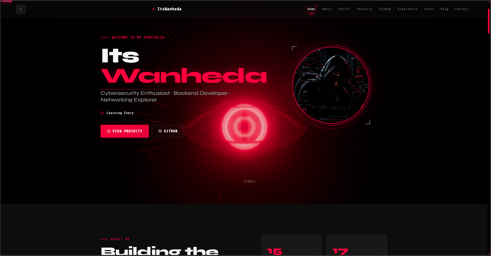

# 🛡️ Portfolio — Cybersecurity & Backend Engineering

<p align="center">
  <strong>Cybersecurity Enthusiast · Backend Developer · Networking Explorer</strong>
</p>

<p align="center">
  <a href="https://github.com/ItsWanheda/portfolio/actions/workflows/deploy.yml">
    
  </a>
  
  
  
  
</p>

  <a href="https://github.com/ItsWanheda/portfolio/issues">
    Report Bug
  </a>
  ·
  <a href="https://github.com/ItsWanheda/portfolio/issues">
    Request Feature
  </a>
</p>

> **A cybersecurity-themed portfolio built from scratch with vanilla HTML, CSS, and JavaScript.**

---

## 📑 Contents

* [🧠 About](#-about)
* [✨ Features](#-features)
* [🛠️ Tech Stack](#️-tech-stack)
* [🚀 Quick Start](#-quick-start)
* [⚙️ Configuration](#️-configuration)
* [🎨 Customization](#-customization)
* [🔒 Security](#-security)
* [🐛 Known Issues](#-known-issues)
* [🗺️ Roadmap](#️-roadmap)
* [🤝 Contributing](#-contributing)
* [📜 License](#-license)
* [📞 Contact](#-contact)
* [🙏 Acknowledgments](#-acknowledgments)

---

## 📸 Preview

<p align="center">
  
</p>

---

## 🧠 About

This is my personal **cybersecurity and backend engineering portfolio**, built without a frontend framework or runtime dependency.

It is more than a résumé — it is a practical demonstration of how I approach software:

> **Secure by design. Performant by default. Beautiful by intention.**

The portfolio reflects my focus across four areas:

| Focus                       | What it covers                                           |
| --------------------------- | -------------------------------------------------------- |
| 🔐 **Cybersecurity**        | Protocol analysis, attack vectors, defensive programming |
| ⚙️ **Backend Engineering**  | REST APIs, authentication systems, data modeling         |
| 🌐 **Networking**           | TCP/IP, TLS, DNS, packet analysis                        |
| 💻 **Software Engineering** | Clean code, modular architecture, type safety            |

> *“Building secure systems one project at a time.”*

---

## ✨ Features

### 🎨 Design & Experience

* 🟥 Cyberpunk-inspired dark interface with a red accent palette
* 🖱️ Custom animated cursor with interactive hover effects
* 🌐 Canvas-based network background with connected nodes
* ⌨️ Typewriter animation in the hero section
* ✨ Smooth scroll-reveal animations using `IntersectionObserver`
* 📱 Responsive across mobile, tablet, desktop, and ultrawide displays
* ♿ Accessibility considerations including ARIA labels, keyboard navigation, and reduced-motion support
* 🖨️ Dedicated print stylesheet for clean résumé printing

### ⚡ Performance

* 🚫 Zero runtime dependencies
* 🎨 Pure HTML, CSS, and JavaScript
* 💤 Lazy rendering for off-screen content
* 🎞️ `requestAnimationFrame` optimized canvas animations
* 📱 Custom cursor automatically disabled on touch devices
* 📦 No bundler or build system required

### 🛡️ Security

* 🚫 No third-party analytics or tracking
* 🔐 CSP-ready markup
* 🔒 External resources loaded over HTTPS
* 🔍 Open-source and fully auditable codebase
* 🚫 No `eval()`, `Function()`, or unsafe DOM sinks

### 📑 Portfolio Sections

| Section               | Purpose                                     |
| --------------------- | ------------------------------------------- |
| 🏠 **Hero**           | Introduction, avatar, and primary CTAs      |
| 🧰 **Skills**         | Filterable technology stack                 |
| 🐙 **GitHub**         | Repository showcase and language statistics |
| 📈 **Experience**     | Interactive learning timeline               |
| 🎓 **Certifications** | Credentials and badges                      |
| 📝 **Blog**           | Technical articles and writeups             |
| 📬 **Contact**        | Email and social links                      |

---

### Deploy Your Own

1. Fork this repository.
2. Open **Settings → Pages**.
3. Select **Deploy from a branch**.
4. Choose `main` and `/ (root)`.
5. Save and wait for GitHub Pages to publish the site.

---

## 🛠️ Tech Stack

| Layer               | Technology                       | Purpose                            |
| ------------------- | -------------------------------- | ---------------------------------- |
| **Markup**          | HTML5                            | Semantic structure & accessibility |
| **Styling**         | CSS3                             | Layout, theme, animations          |
| **Logic**           | Vanilla JavaScript / ES6 Modules | Interactivity & rendering          |
| **Animation**       | Canvas API + CSS Keyframes       | Visual effects & transitions       |
| **Typography**      | Syne · DM Sans · Share Tech Mono | Display, body & monospace text     |
| **Version Control** | Git + GitHub                     | Source control & deployment        |

### Why No Framework?

This portfolio intentionally avoids React, Vue, Next.js, and other frontend frameworks.

The goal is to demonstrate what can be achieved with the fundamentals:

**HTML → CSS → JavaScript → Browser APIs**

Every animation, interaction, responsive breakpoint, and component is implemented directly.

---

## 🚀 Quick Start

### Requirements

That's it:

* A modern browser
* Git
* Optional: Python 3 for a local development server

No Node.js, npm, build tools, or framework are required.

### Clone

```bash
git clone https://github.com/ItsWanheda/portfolio.git
cd portfolio
```

### Run Locally

#### Option 1 — Open directly

**Windows**

```bash
start index.html
```

**macOS**

```bash
open index.html
```

**Linux**

```bash
xdg-open index.html
```

#### Option 2 — Recommended

Using Python:

```bash
python -m http.server 8000
```

Then open:

```text
http://localhost:8000
```

You can also use any local static server that correctly serves ES modules.

---

## ⚙️ Configuration

The portfolio is driven primarily by JavaScript data objects in:

```text
src/js/main.js
```

No CMS, database, or JSON import pipeline is required.

### 👤 Personal Information

Update the relevant constants:

```javascript
const TYPED_STRINGS = [
  'Building Secure Systems...',
  // Add your own phrases
];

const GITHUB_USERNAME = 'ItsWanheda';

const CONTACT_DATA = [
  {
    icon: '⚡',
    label: 'GitHub',
    value: 'github.com/ItsWanheda',
    // ...
  },
  {
    icon: '📧',
    label: 'Email',
    value: 'your@email.com',
    // ...
  }
];
```

### 🎨 Theme

Edit the CSS custom properties in:

```text
src/css/style.css
```

Example:

```css
:root {
  --black: #0A0A0A;
  --red: #FF003C;
  --white: #F5F5F5;
  --muted: #888888;
}
```

Changing these variables allows the main color scheme to be customized without rewriting individual components.

---

## 🎨 Customization

### 📝 Add a Blog Post

Append to `BLOG_DATA`:

```javascript
{
  num: '07',
  tag: 'Category',
  title: 'Your Article Title',
  excerpt: 'Short article preview.',
  date: 'Jun 2025',
  readTime: '5 min',

  content: `
    <p>Your HTML content here...</p>

    <h3>Section</h3>

    <pre>
      <code>// Code blocks work too</code>
    </pre>
  `,
}
```

### 🧰 Add a Skill

Add a skill to `SKILLS_DATA`:

```javascript
{
  name: 'Rust',
  icon: '🦀',
  cat: 'languages',
  level: 40,
}
```

For additional information:

```javascript
'Rust': {
  desc: 'Memory-safe systems programming language.',
  exp: 'Currently exploring for security tooling.',
  projects: [
    'Memory-safe port scanner',
  ],
}
```

---

## 🔒 Security

Security is a core consideration of this project.

For more information:

* 📄 **Vulnerability reporting** → `SECURITY.md`
* 🛡️ **Security headers** → security section in the source code
* 📦 **Dependencies** → zero external runtime dependencies

### Security Practices

* ✅ No third-party analytics or tracking
* ✅ External resources loaded over HTTPS
* ✅ Reduced-motion preference respected
* ✅ No `eval()` or `Function()`
* ✅ Avoidance of unsafe DOM sinks
* ✅ Click-to-copy contact information
* ✅ Print stylesheet disables interactive elements
* ✅ Source code remains open and auditable

---

## 🐛 Known Issues

A few minor limitations remain:

* 🖱️ The custom cursor may stutter on low-end devices while the canvas background is active.
* 🍎 Safari iOS has minor cosmetic differences in `backdrop-filter` rendering.
* 📜 Long blog articles inside modals require manual scrolling; keyboard arrow keys do not automatically scroll the modal body.

---

## 🗺️ Roadmap

Potential future improvements:

* [ ] Improve canvas performance on low-end devices
* [ ] Further optimize mobile rendering
* [ ] Expand technical blog content
* [ ] Add more cybersecurity-focused projects
* [ ] Improve accessibility coverage
* [ ] Add additional performance optimizations
* [ ] Expand GitHub integration

---

## 🤝 Contributing

Contributions are welcome.

Whether it's a bug fix, documentation improvement, performance optimization, or new feature, feel free to open an issue or submit a pull request.

### Development Workflow

```bash
# 1. Fork the repository

# 2. Create a feature branch
git checkout -b feature/AmazingFeature

# 3. Make your changes

# 4. Commit
git commit -m "feat: add AmazingFeature"

# 5. Push
git push origin feature/AmazingFeature

# 6. Open a Pull Request
```

### Code Style

* Use **2-space indentation**
* Use **single quotes** for JavaScript strings
* Prefer semantic HTML elements
* Follow a mobile-first CSS approach
* Comment non-obvious logic
* Keep changes focused and maintainable

---

## 📜 License

See [`LICENSE`](./LICENSE) for the full license text.

---

## 📞 Contact

<p align="center">

**ItsWanheda**
Cybersecurity Enthusiast · Backend Developer · Networking Explorer

<br><br>

<a href="https://github.com/ItsWanheda">
  
</a>

<a href="mailto:Wanheda.work@gmail.com">
  
</a>

</p>

**Project:**
https://github.com/ItsWanheda/portfolio

---

## 🙏 Acknowledgments

Built with knowledge, inspiration, and resources from:

* 📚 **MDN Web Docs** — web standards and browser APIs
* 🎨 **CSS-Tricks** — CSS, Flexbox, and Grid resources
* 🧪 **TryHackMe & Hack The Box** — hands-on cybersecurity learning
* 🛡️ **OWASP Foundation** — web security practices
* 🌐 **Open-source community** — tools, fonts, ideas, and inspiration

---

<p align="center">
  <sub>Built with HTML, CSS, JavaScript, curiosity, and a questionable amount of caffeine. ☕</sub>
</p>
